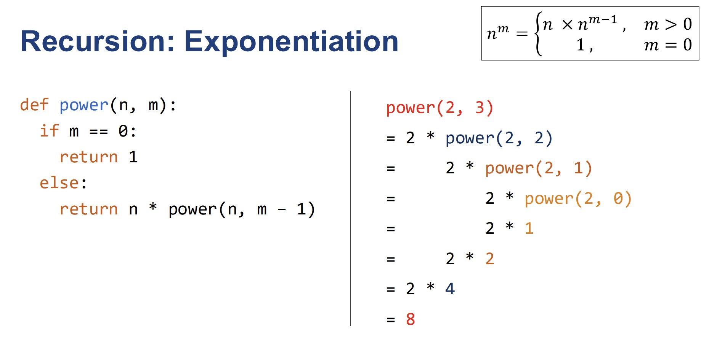

# Iteration 
- While or For loop
- Initialization: Starting value for the condition variable
- Condition: Conditional expression to stay within the loop
- Body:
  - Accumulate the result
  - Modify the condition variable inside the loop, especially using while loop

# Recursion 
- Base Case
 - Terminating condition
- Recursive Case
 - Function that calls itself to solve a similar but simpler problem

Note that base case is m == 0 which outputs return 1

# Recursive Stack vs Recursive Tree

The **Recursive stack** and **Recursive tree** are two different ways to represent or understand recursion
---

## **1. Recursive Stack**
The **recursive stack** refers to the internal mechanism used by the computer to manage recursive function calls. Each function call is pushed onto the stack, and the function's local variables, parameters, and return address are stored there. When a function completes execution, it is popped off the stack.

### Characteristics:
- **Linear Representation**: The stack grows linearly with each recursive call.
- **Tracks Execution State**: It stores the current state of a function, such as local variables and the point to return to after execution.
- **Used for Backtracking**: The stack enables returning to previous calls when deeper recursive calls finish.

### Example (Factorial):
A recursive function for factorial:
```python
def factorial(n):
    if n == 0:
        return 1
    return n * factorial(n - 1)
```

For `factorial(3)`, the stack would look like this:

1. Call `factorial(3)` → Push onto stack.
2. Call `factorial(2)` → Push onto stack.
3. Call `factorial(1)` → Push onto stack.
4. Call `factorial(0)` → Push onto stack, and return 1.
5. Resolve `factorial(1)` → Pop and return `1 * 1 = 1`.
6. Resolve `factorial(2)` → Pop and return `2 * 1 = 2`.
7. Resolve `factorial(3)` → Pop and return `3 * 2 = 6`.

---

## **2. Recursive Tree**
The **recursive tree** is a visual representation of how recursion branches out, showing all the recursive calls and their results. Each recursive call is represented as a node in the tree, and the children represent further recursive calls.

### Characteristics:
- **Non-linear Representation**: The recursive tree branches out like a tree structure.
- **Visualizes Subproblems**: Each node represents a subproblem being solved.
- **Shows Overlapping Calls**: Useful for understanding redundant computations, especially in problems like Fibonacci.

### Example (Fibonacci):
A recursive function for Fibonacci:
```python
def fibonacci(n):
    if n <= 1:
        return n
    return fibonacci(n - 1) + fibonacci(n - 2)
```

For `fibonacci(4)`, the recursive tree looks like this:

```
               fibonacci(4)
         /                   \
    fibonacci(3)             fibonacci(2)
    /      \                      /      \
fibonacci(2) fibonacci(1) fibonacci(1) fibonacci(0)
 /      \
fibonacci(1) fibonacci(0)
```

### Key Insights:
- The tree helps in understanding how recursion works by showing all the calls.
- In problems like Fibonacci, the tree highlights **overlapping subproblems**, which can be optimized using dynamic programming or memoization.

---

## **Key Differences**

| **Aspect**         | **Recursive Stack**                      | **Recursive Tree**                     |
|---------------------|------------------------------------------|-----------------------------------------|
| **Purpose**         | Tracks function calls and execution flow| Visualizes all recursive calls         |
| **Structure**       | Linear (stack-like)                     | Non-linear (tree-like)                 |
| **Visualization**   | Shows active calls and their states      | Represents the branching of recursion  |
| **Use Case**        | Understanding memory usage and backtracking | Debugging logic and identifying redundant calls |

---

## **When to Use Each?**
- Use the **recursive stack** to understand how recursion is managed internally, especially when debugging memory-related issues like stack overflow.
- Use the **recursive tree** to analyze recursion logic, identify overlapping subproblems, and optimize solutions (e.g., using dynamic programming).


