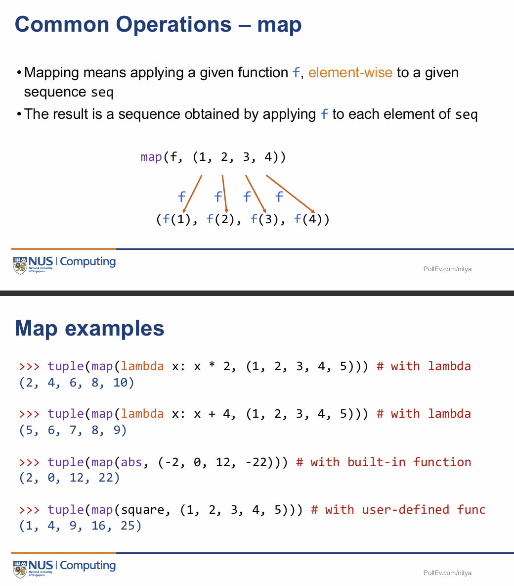
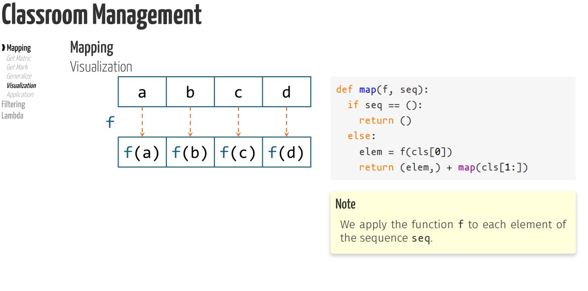
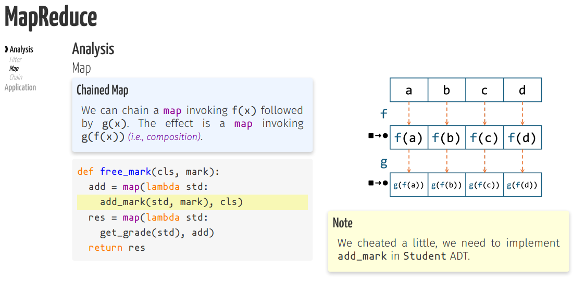
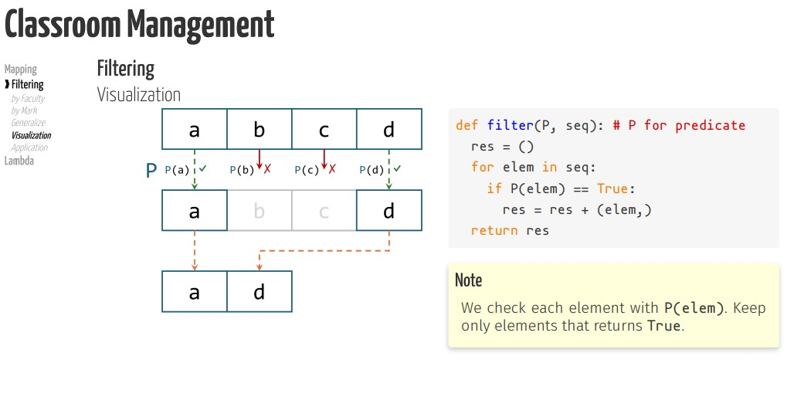
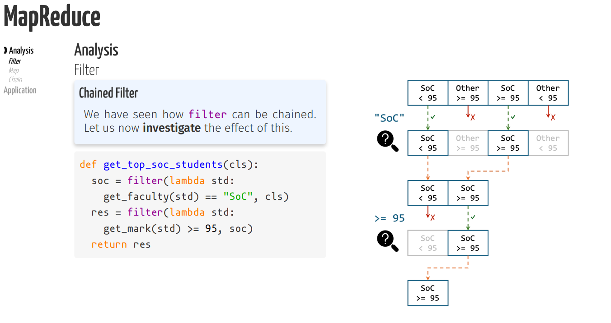

# Map
- Python built in map function does not return a tuple but an iterator, means you have to convert it to 
a tuple manually
```python
result = map(square, [1, 2, 3, 4])
print(result)  
# Output: <map object at 0x...>  (iterator)

print(tuple(result))  
# Output: (1, 4, 9, 16)  (converted to tuple manually)
```
- Mapping means applying a given function f, element wise to a given sequence

- The result is a sequence obtained by applying f to each element of seq


## Generalize Mapping functions
``` python
def get_all_matric(cls): # Iteration
    res = ()
    for std in cls:
        elem = get_matric(std)
        res = res + (elem, )
    return res
```
```python
def get_all_matric(cls): #recursion
    if cls == ():
        return ()
    else:
        elem = get_matric(cls[0])
        res = get_all_matric(cls[1:])
        return (elem,) + res
```
```python
def get_all_mark(cls): # Iteration
    res = ()
    for std in cls:
        elem = get_mark(std)
        res += (elem, )
    return res
```
```python
def get_all_mark(cls): # recursion
    if cls == ():
        return ()
    else:
        elem = get_mark(cls[0])
        res = get_all_mark(cls[1:])
        return (elem,) + res
```

```python
def map(f, seq): # We apply the function f to each element of the seq
    if seq == ():
        return ()
    else:
        elem = f(cls[0])
        return (elem,) + map(cls[1:])
``` 

^^^ NOTE THAT WE CANNOT SWAP THE ORDER OF MAP WITHOUT AFFECTING RESULT 
f(g(a)) != g(f(a))

# Filtering

## Generalize filter functions
```python
def get_soc_students(cls): # Iteration
    res = ()
    for std in cls:
        if get_faculty(std) == "SoC":
            res += (std,)
        return res
```

```python 
def get_top_students(cls):
    res = ()
    for std in cls:
        if get_mark(std) >= 95:
            res += (std,)
    return res
```
### Is there a better way to filter? Yes! 

```python
def filter(P,seq): # Python has a built in filter function but need to manually convert to appropriate DS
    res = ()
    for elem in seq:
        if P(elem) == True:
            res = res +(elem,)
    return res
```

# Lambda
- Lambda function allows us to write small function in a single line of code
- Used for short, simple operations that are not reused elsewhere in the code
- Frequently used with built in functions: map(), filter()
```python
lambda arguments: expression
```
- It **does not have a name** (unlike `def` functions).
- It **returns the result** of the expression automatically.
- It is **often used for short, simple operations**.

## 2. Example: Squaring a Number
Using a normal function:
```python
def square(x):
    return x * x
print(square(4))  # Output: 16
```

Using `lambda`:
```python
square = lambda x: x * x
print(square(4))  # Output: 16
```

---

## 3. Example: Adding Two Numbers
```python
add = lambda x, y: x + y
print(add(3, 5))  # Output: 8
```

---

## 4. Using Lambda Inside `map()`
The **`map()` function** applies a function to each element in a list.

```python
numbers = [1, 2, 3, 4]
squared_numbers = list(map(lambda x: x * x, numbers))

print(squared_numbers)  
# Output: [1, 4, 9, 16]
```

---

## 5. Sorting with Lambda
Sorting by the second element in a list of tuples:
```python
pairs = [(1, 3), (2, 2), (4, 1)]
sorted_pairs = sorted(pairs, key=lambda x: x[1])

print(sorted_pairs)  
# Output: [(4, 1), (2, 2), (1, 3)]
```

---

## 6. Filtering with Lambda
Using `filter()` to keep only even numbers:
```python
numbers = [1, 2, 3, 4, 5, 6]
even_numbers = list(filter(lambda x: x % 2 == 0, numbers))

print(even_numbers)  
# Output: [2, 4, 6]
```